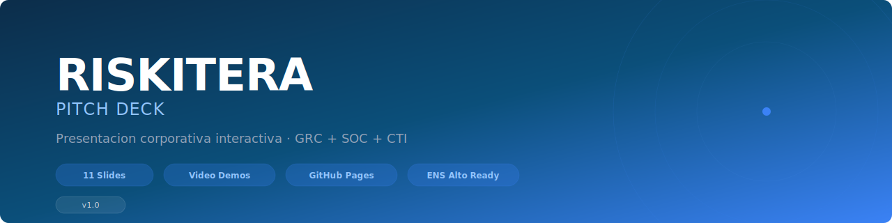

<div align="center">



<br/>

[](https://pedri77.github.io/riskitera-pitch-deck/)
[](https://www.youtube.com/@Riskitera-m6y)
[](https://demo.riskitera.com)

<br/>

### 🛡️ Compliance continuo potenciado por IA

**Las empresas reguladas gastan miles de horas en auditorias manuales, alertas sin contexto y reports que llegan tarde.**
**Riskitera lo automatiza. GRC + SOC + CTI en una sola plataforma soberana.**

<br/>

</div>

---

## 💡 La oportunidad

El mercado europeo de GRC crece a doble digito. Las regulaciones (ENS Alto, NIS2, DORA, AI Act) se multiplican. Los equipos de compliance no dan abasto.

**Riskitera** es la primera plataforma que unifica governance, operaciones de seguridad e inteligencia de amenazas con IA, manteniendo el 100% de los datos en infraestructura europea.

---

## 🎬 Que encontraras en esta presentacion

| | |
|:---:|:---|
| 📊 | **11 slides** con la narrativa completa: problema, solucion, mercado, producto, traccion, equipo y financials |
| 🎥 | **4 demos en video** del producto real funcionando: Overview, GRC, SOC y CTI |
| 💰 | **Modelo de negocio** B2B SaaS con pricing validado y pipeline activo |
| 🤝 | **Partnerships** con Telefonica Tech, Indra y T-Systems |
| 🇪🇺 | **Soberania total**: infraestructura 100% europea, ENS Alto, RGPD nativo |

<br/>

<div align="center">

### 👉 [Ver la presentacion completa](https://pedri77.github.io/riskitera-pitch-deck/) 👈

</div>

---

## 🚀 Siguiente paso

¿Quieres ver la plataforma en accion? Solicita acceso a la demo o agenda una llamada directa.

<div align="center">

[](https://www.linkedin.com/in/david-moya-b3a77547/)
[](mailto:david@riskitera.com)
[](https://riskitera.com)
[](tel:+34629346366)

</div>

---

<div align="center">

```
━━━━━━━━━━━━━━━━━━━━━━━━━━━━━━━━━━━━━━━━━━━━━━━━━━━━━━
```

**[Riskitera](https://riskitera.com)** · Compliance continuo potenciado por IA · 🇪🇸 Made in Spain

</div>
